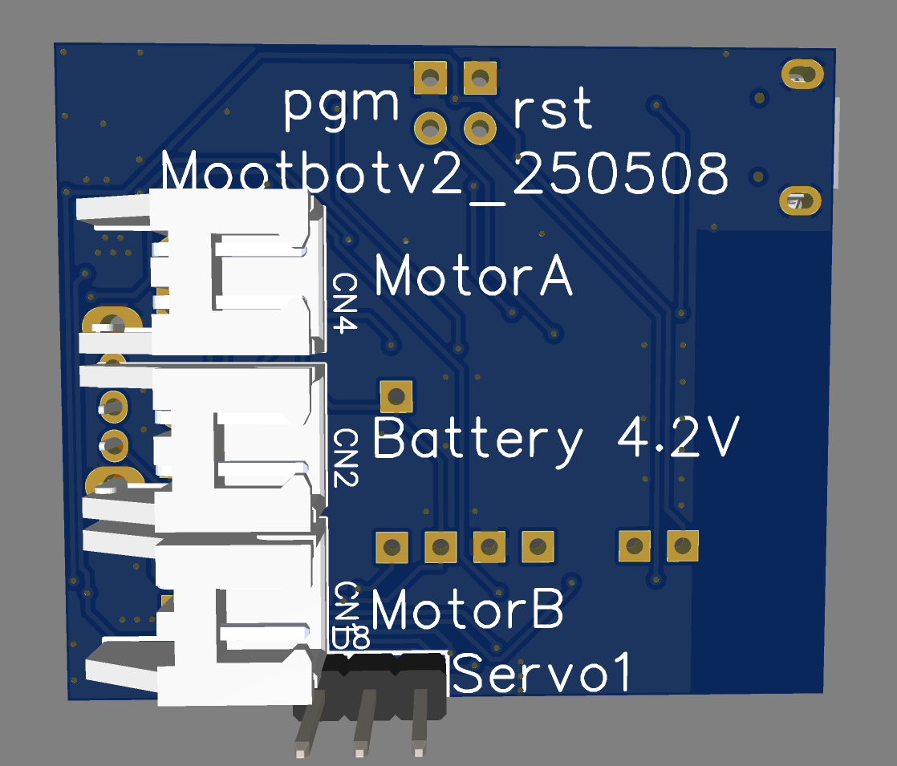
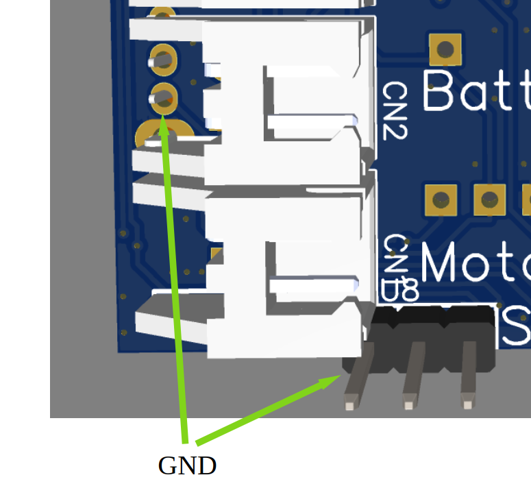
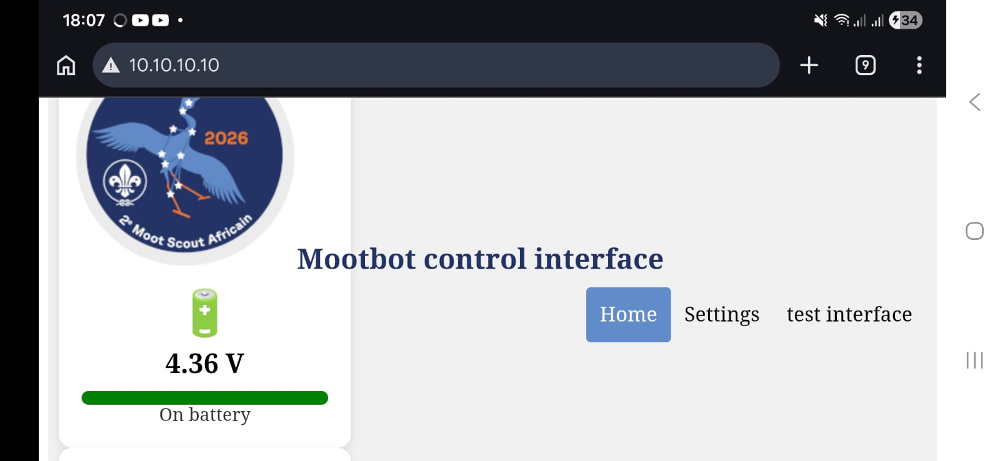
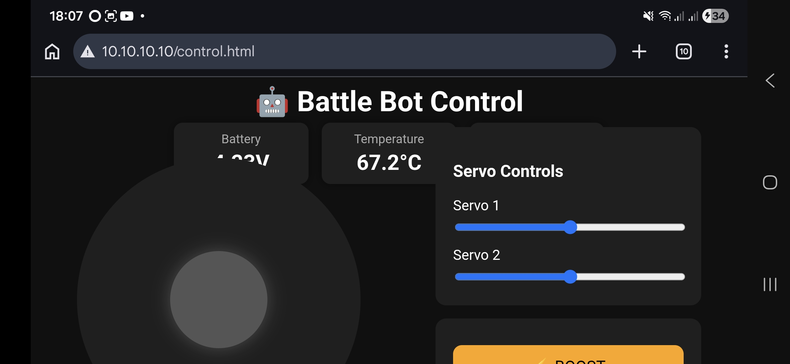

# Assembly & Setup

<Refdes id="J1">From parts to first drive</Refdes>

This guide covers everything from soldering your last header to driving the robot from your phone. Read it once before you start — the whole process takes about fifteen minutes.

## Parts checklist

Before you begin, confirm you have all of these:

- [x] Kijani controller PCB
- [x] 1S LiPo battery (3.7 V nominal)
- [x] 2 × DC motors (N20 gear motors recommended)
- [x] 1 × servo


:::warning
Check that every part is present before you start. Missing a motor or battery connector mid-build is frustrating.
:::

## Board orientation

Familiarise yourself with the PCB before connecting anything.

### Front

ESP32 module, motor and servo headers, USB port:


### Back

Ground pads and solder jumpers:



## Connecting the components

<Refdes id="SW1">Step 1 — Power off</Refdes>

Make sure the power switch is in the **OFF** position before connecting anything.
If your board doesn't have a labelled switch, OFF is the position away from the servo connector (on the other side of the board).

<Refdes id="BT1">Step 2 — Connect the battery</Refdes>

Plug the battery into the battery connector.

:::danger[Battery polarity matters]

The black (negative) wire must connect to the **square pad**. Reversing polarity can permanently damage the board.

> If you are using an officially-prepared kit, this should not be a problem. We still recommend double-checking for safety.

:::



<Refdes id="M1">Step 3 — Connect the motors</Refdes>

Connect both motors to the motor output headers.

:::tip[Motor Polarity]

Motor polarity is not critical - if the robot drives backwards later, swap the wires or invert the direction in your control page.

:::

:::info[Struggling to connect it?]

If you are struggling to connect the motors, try removing it, then jiggling it around whilst inserting it.

These connections are strong and tight when new, so you may need to use a bit more force. **Avoid breaking it, though**.

:::

<Refdes id="S1">Step 4 — Connect the servo</Refdes>

Plug the servo into one of the servo headers.

:::danger[Servo polarity matters]

The brown or black wire must connect to the **square pad**. A reversed servo connector can burn out the servo.

:::

:::info[Struggling to connect it?]

If you are struggling to connect a servo, try removing it, then jiggling it around whilst inserting it.

These connections are strong and tight when new, so you may need to use a bit more force. **Avoid breaking it, though**.

:::

## Charging

The battery charges over the Micro USB connector on the board.

1. Turn the robot **OFF**.
2. Plug in a Micro USB cable.
3. Wait for the charge indicator LED to show a full charge before unplugging.

:::tip
Always charge with the robot powered off. The motors draw enough current to slow or prevent charging.
:::

## Connecting to the robot

<Refdes id="AP">Step 1 — Power on</Refdes>

Flip the switch to **ON**. You should hear a startup tune played through the motors — that confirms the firmware is running.

<Refdes id="WiFi">Step 2 — Join the network</Refdes>

On your phone, tablet or laptop, connect to the WiFi network named:

```
MootBot_xxxxxx
```

where `xxxxxx` is a unique identifier for your board.

Your device may warn that the network has no internet access. Choose **Stay Connected** or **Use This Network Anyway** — the robot is a local access point, not an internet gateway.

<Refdes id="HTTP">Step 3 — Open the browser</Refdes>

In your browser, navigate to:

<Terminal host="10.10.10.10" lines={[
  { get: 'localhost:10.10.10.10' },
]} />

<br />

You should see the robot's home page:



## Driving the robot

From the home page, open **controller.html**. The default control interface lets you drive both motors and move the servo.



That's it — you're driving. Steer with the on-screen controls, check that both motors respond, and confirm the servo swings.

## Uploading your own control pages

<Refdes id="FS">Custom interfaces</Refdes>

One of Kijani's main features is that you can replace the control UI entirely. The pages are plain HTML, CSS and JavaScript stored in LittleFS on the ESP32 — upload your own from the home page and the robot serves them immediately.

Use the stock `controller.html` as a starting point, or write something from scratch against the HTTP API.


:::caution
There is no overwrite protection. Back up any file before replacing it. A factory reset does **not** restore deleted or modified web pages — you would need to re-flash the filesystem from a computer.
:::

## Settings

Open the **Settings** page from the home screen to configure:

- WiFi network name (SSID)
- WiFi password
- Robot-specific configuration values
- System information and firmware version


## Firmware updates

The current firmware version is shown on the home page. To update:

1. Download the latest `.bin` file from the [GitHub releases](https://github.com/zaplakkies/kijani/releases).
2. Open the **Firmware Update** page on the robot.
3. Upload the `.bin` file.
4. Wait for the update to complete — the controller restarts automatically.

:::warning
Make sure the battery is fully charged before starting a firmware update. A power loss mid-flash can brick the board until you re-flash over USB.
:::

## Factory reset

If you forget the WiFi password:

1. Turn the controller **OFF**.
2. Short the **PGM** pins together (use a jumper wire or tweezers).
3. Turn the controller **ON**.
4. Wait for the factory reset tune.

This restores the default SSID and password but does **not** restore deleted files. If system files are missing or damaged, reconnect the board to a computer and re-upload the filesystem image via PlatformIO.

## Troubleshooting

<FeatureGrid>
  <FeatureCard refdes="WiFi" title="Can't see the WiFi network">
    Check that the battery is connected and the switch is ON. Listen for the startup tune. If there's no tune, the battery may be flat — charge it over USB and try again.
  </FeatureCard>
  <FeatureCard refdes="M1" title="Robot drives backwards">
    Swap the two wires on the affected motor, or invert the direction in your control page's JavaScript.
  </FeatureCard>
  <FeatureCard refdes="S1" title="Servo doesn't move">
    Check the servo header orientation (brown/black wire to the square pad), confirm the battery is charged, and verify the servo is plugged into the header your control page addresses (S1 or S2).
  </FeatureCard>
  <FeatureCard refdes="BT1" title="Board restarts under load">
    Usually a low battery. Charge fully and retry. If it persists, check for short circuits on the motor wiring.
  </FeatureCard>
  <FeatureCard refdes="PGM" title="Forgot the WiFi password">
    Perform a factory reset (short the PGM pins, power cycle, wait for the tune).
  </FeatureCard>
  <FeatureCard refdes="FS" title="Deleted an important file">
    Reconnect the board to a computer via USB and re-upload the LittleFS filesystem image through PlatformIO.
  </FeatureCard>
</FeatureGrid>
