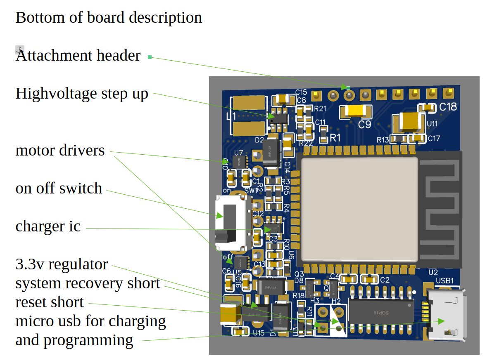

# Lesson 1: Introduction to Kijani

Welcome to your first lesson! In this lesson, you will get familiar with the Kijani board, understand its parts, and learn how to handle it safely.

---

## What you will learn
* What Kijani is and how it works.
* What hardware is included on the board.
* What devices can be connected to Kijani.
* A high-level overview of the web interface.
* Critical safety rules for handling motors and external power.

---

## What you need
* **1 × Kijani Controller Board**
* **1 × USB Cable** (for power)
* **1 × 1S LiPo Battery** (optional but recommended)

---

## Background

### What is Kijani?
**Kijani** is an affordable, custom ESP32-based robotics and physical computing platform. Unlike typical microcontrollers that require complex coding environments, compilation, and wires to download code, Kijani runs an onboard webserver. It allows you to build control pages in standard HTML, CSS, and JavaScript and upload them directly over Wi-Fi.

Because Kijani has built-in H-bridges (motor drivers), battery charger, voltage-boosting regulator, and servo headers, you do not need separate driver shields or a tangle of jumper wires to get moving. You can also add some shields if you wish.

---

## Connect it

Before connecting power, look at the front of your Kijani board.

* Find the **ESP32 module** (the silver and black rectangular chip with the antenna at the top).
* Locate the **Power Switch** (labeled ON/OFF). Ensure it is set to **OFF** for now.
* Find the two **Motor output headers** near the bottom.
* Locate the two **Servo output headers** on the right side.

[TODO: add picture of v3 board here]

Now, connect your board to power:
1. Plug the **USB cable** into the USB port.
2. Flip the power switch to **ON**.

---

## Try it

Let's verify that the board's preloaded firmware is active.

1. Watch the **Status LED** (GPIO 2, the led light). 
2. It should blink rapidly, indicating that the Wi-Fi Access Point is starting up.
3. If you have a motor connected to Motor 1 (Left), you will hear a quick musical startup chime!

---

## What should happen
* The status LED blinks regularly.
* The Kijani board broadcasts a Wi-Fi network with its name.
* No smoke or excessive heat is generated by any component.

---

## Experiment
* Flip the switch to **OFF**, then back to **ON**. Notice how quickly the ESP32 starts up and begins blinking.
* Observe the charging LED if you connect a battery and plug in the USB cable simultaneously.

---

## Challenge
Find the unique 6-digit identifier of your Kijani board. You can find this on the sticker or by searching for available Wi-Fi networks on your phone.

---

## Troubleshooting
* **No LED light?** Check if the USB cable is fully plugged in or if the power switch is flipped to ON.
* **Red charging light blinks?** This is normal if a USB cable is connected but no battery is attached.

---

## Next step
Now that your board is powered and working, let's connect to its Wi-Fi and explore the web panel!

👉 **[Lesson 2: Webserver Basics](./02-webserver.md)**
