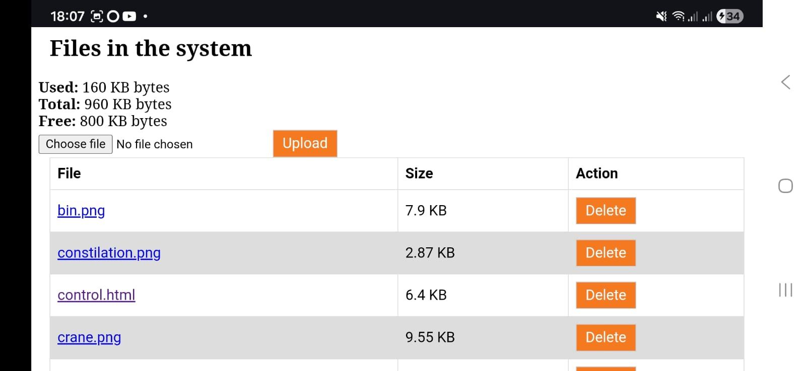
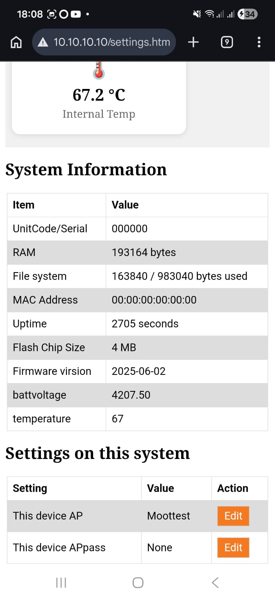

# Customisation

## Uploading your own control pages

<Refdes id="FS">Custom interfaces</Refdes>

One of Kijani's main features is that you can replace the control UI entirely. The pages are plain HTML, CSS and JavaScript stored in LittleFS on the ESP32 — upload your own from the home page and the robot serves them immediately.

Use the stock `controller.html` as a starting point, or write something from scratch against the HTTP API.

:::caution
There is no overwrite protection. Back up any file before replacing it. A factory reset does **not** restore deleted or modified web pages — you would need to re-flash the filesystem from a computer.
:::

## Settings

Open the **Settings** page from the home screen to configure:

- WiFi network name (SSID)
- WiFi password
- Robot-specific configuration values
- System information and firmware version

For firmware updates and factory reset, see [Maintenance](./maintenance.md).
