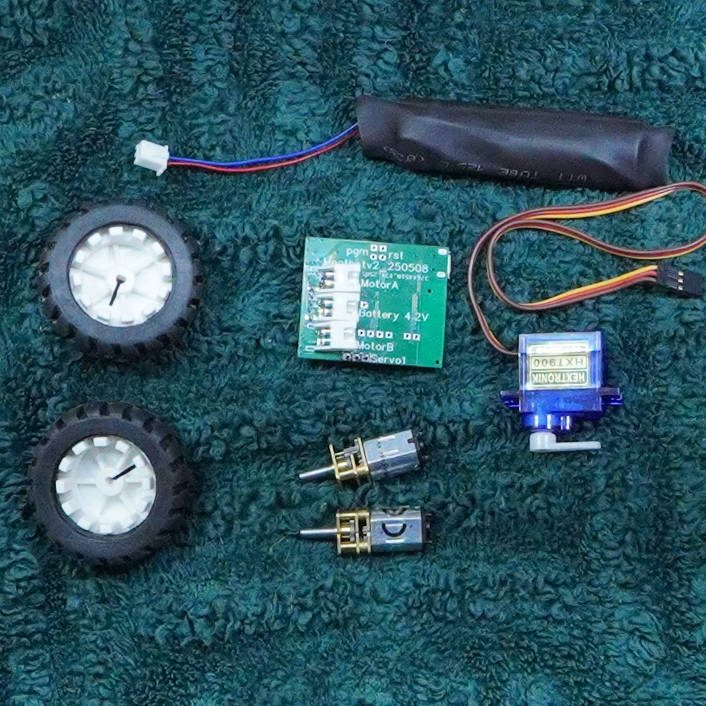
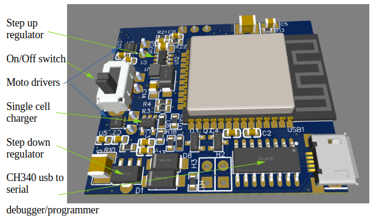

# Getting Started

<Refdes id="J1">From parts to first drive</Refdes>

This guide covers everything from soldering your last header to driving the robot from your phone. Read it once before you start — the whole process takes about fifteen minutes.

The manual is split into short pages:

1. **[Getting Started](./index.md)** (this page) — parts checklist and board orientation
2. **[Assembly](./assembly.md)** — connecting the battery, motors and servo, plus charging
3. **[First Drive](./first-drive.md)** — joining the robot's WiFi and driving it from a browser
4. **[Customisation](./customisation.md)** — uploading your own control pages and changing settings
5. **[Maintenance](./maintenance.md)** — firmware updates and factory reset
6. **[Troubleshooting](./troubleshooting.md)** — common problems and fixes

## Parts checklist

Before you begin, confirm you have all of these:

- [x] Kijani controller PCB
- [x] 1S LiPo battery (3.7 V nominal)
- [x] 2 × DC motors (N20 gear motors recommended)
- [x] 1 × servo

:::warning
Check that every part is present before you start. Missing a motor or battery connector mid-build is frustrating.
:::

## Board orientation

Familiarise yourself with the PCB before connecting anything.

### Front

ESP32 module, motor and servo headers, USB port:

### Back

Ground pads and solder jumpers:

Ready? Move on to [Assembly](./assembly.md).
